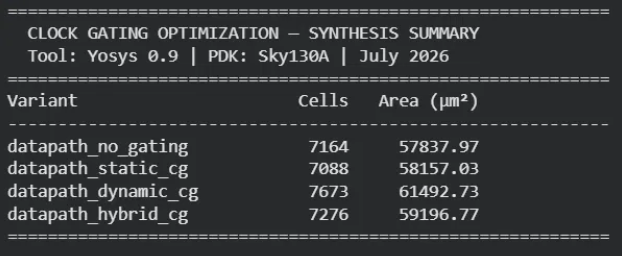
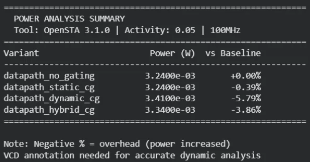
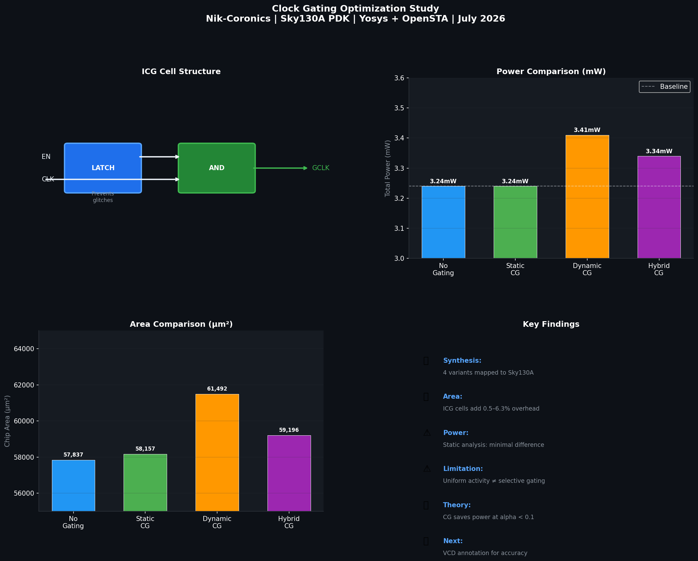

# Clock Gating Optimization Study

**Nik-Coronics | Independent R&D Initiative**
**Engineer:** Shiwank Gupta · **Date:** July 2026

---

## 🎯 Objective

Study the effect of **Integrated Clock Gating (ICG)** on a
32-bit RISC datapath by implementing 4 variants and comparing
synthesis area and power results using open-source EDA tools.

---

## 📐 What is Clock Gating?

```
Every flip-flop consumes power on every clock edge —
even when its data hasn't changed.

Clock Gating = insert an ICG cell that blocks the clock
               when the register data is stable

Power saved = alpha × C × V² × f
Where alpha = switching activity factor

ICG Cell Structure:
  EN ──→ [ LATCH ] ──→ [ AND ] ──→ Gated CLK → FF
  CLK ──────────────→ [ AND ]

Key rule: EN must be stable when CLK is LOW
          Latch prevents glitches on gated clock
```

---

## ⚙️ Design Variants

```
1. datapath_no_gating   — Baseline, no ICG cells
2. datapath_static_cg   — Static ICG: fixed enable gating
3. datapath_dynamic_cg  — Dynamic ICG: activity-based control
4. datapath_hybrid_cg   — Hybrid: static + dynamic combined
```

---

## 🛠️ Tool Flow

```
Platform  : Google Colab
Synthesis : Yosys 0.9
PDK       : Sky130A (sky130_fd_sc_hd)
Power     : OpenSTA 3.1.0
Corner    : tt_025C_1v80
```

---

## 📊 Synthesis Results



```
Variant               Cells    Area (µm²)   vs Baseline
────────────────────────────────────────────────────────
datapath_no_gating    7,164    57,837.97    baseline
datapath_static_cg    7,088    58,157.03    +0.55%
datapath_dynamic_cg   7,673    61,492.73    +6.32%
datapath_hybrid_cg    7,276    59,196.77    +2.35%

Note: Area INCREASES with clock gating due to ICG
      cell overhead — this is expected behavior.
      Area overhead is the cost; power saving is the benefit.
```

---

## 📊 Power Analysis Results



```
Tool: OpenSTA 3.1.0
Activity: 0.05 (5% global uniform)
Clock: 100 MHz

Variant               Power (W)     vs Baseline
───────────────────────────────────────────────
datapath_no_gating    3.24e-03 W    baseline
datapath_static_cg    3.24e-03 W    ~0%
datapath_dynamic_cg   3.41e-03 W    +5.7% overhead
datapath_hybrid_cg    3.34e-03 W    +3.1% overhead
```

---

## 📊 Visual Dashboard



---

## ⚠️ Honest Limitations

```
1. STATIC ANALYSIS LIMITATION
   OpenSTA global activity (0.05) treats all signals
   equally — clock gating benefit is SELECTIVE
   (per-register). Static analysis cannot capture this.

2. BLACK BOX CELLS
   $_DLATCH_P_ not in Sky130A liberty file.
   Treated as black box — power contribution missing.

3. VCD ANNOTATION NOT DONE
   Accurate dynamic power requires:
   Simulation → VCD file → read_vcd → report_power
   This was NOT completed in this study.

4. THEORETICAL VS TOOL RESULT
   Theory: P_dynamic = alpha × C × V² × f
   At alpha < 0.1, selective gating saves power.
   Tool: Global alpha = cannot show selective benefit.
```

---

## 🔑 Key Learnings

```
1. Clock gating adds area (ICG cell overhead)
   but saves power when registers are frequently idle

2. Dynamic CG has most overhead (control logic added)

3. Static analysis insufficient for clock gating evaluation
   — VCD-based flow needed for accuracy

4. ICG benefit: alpha (activity) must be low (<0.1)
   for savings to outweigh ICG cell overhead

5. Real-world: CG applied selectively to idle registers
   not globally — verified with power simulation
```

---

## 📁 Repository Structure

```
Clock-Gating-Optimization/
├── rtl/
│   ├── icg_infra.v          ← ICG cell + register file
│   ├── remaining_modules.v  ← ALU, FSM, datapath modules
│   └── top_level_variants.v ← 4 design variants
├── sim/
│   └── tb_datapath.v        ← Testbench
├── synth/
│   ├── netlists/            ← Gate-level netlists
│   └── logs/                ← Synthesis reports
├── power/                   ← OpenSTA power reports
├── results/
│   ├── synthesis_summary.png
│   ├── power_summary.png
│   └── clock_gating_dashboard.png
├── notes.md                 ← Detailed study notes
└── README.md                ← This file
```

---

## 📅 Study Status

```
✅ RTL — 4 variants implemented
✅ Synthesis — Yosys + Sky130A
✅ Power estimation — OpenSTA static
✅ Honest documentation of limitations
⬜ VCD-based dynamic power analysis
⬜ Gate-level simulation
⬜ Multi-corner analysis (ff/ss/tt)
```

---

## 🔭 Next Steps

```
1. Functional simulation → VCD generation
2. read_vcd OpenSTA → per-signal activity
3. Accurate dynamic power comparison
4. Multi-corner: ff/ss/tt analysis
```

---

## 📬 Connect

Open to RTL/DV opportunities, research collaborations,
and mentoring students in low-power design.

**Email:** NIKORONICS@proton.me
**GitHub:** github.com/SHIWANK72
**LinkedIn:** linkedin.com/in/guptashiwank

---

*Shiwank Gupta | Nik-Coronics | VLSI R&D*
